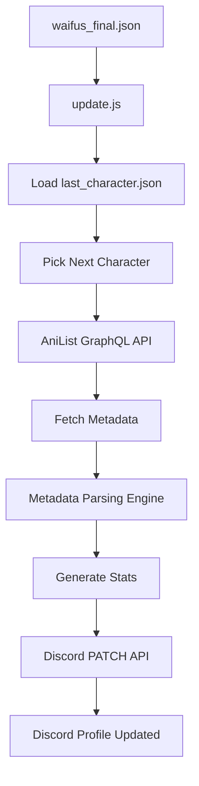
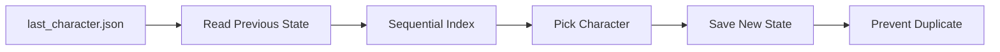
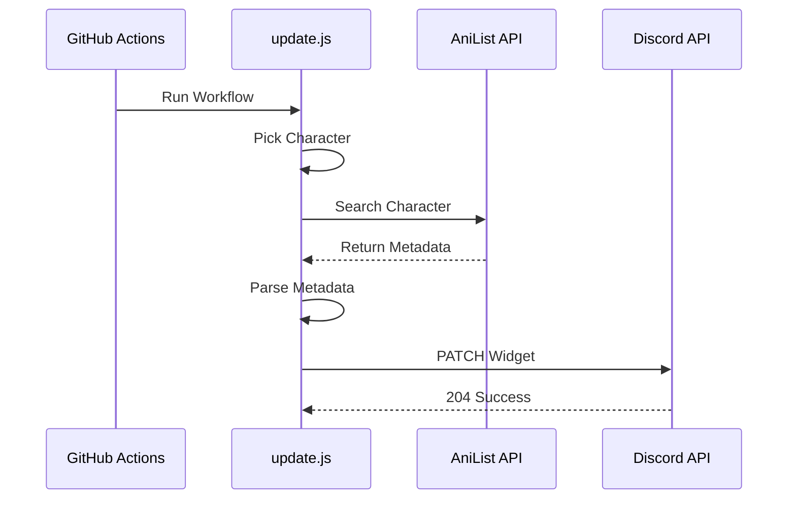
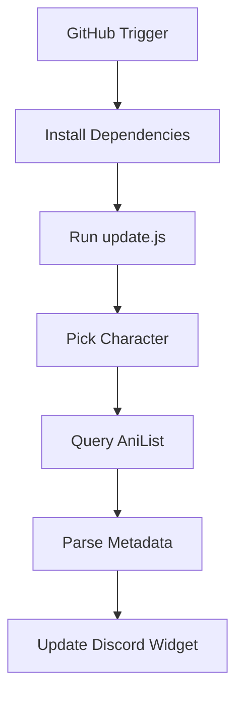
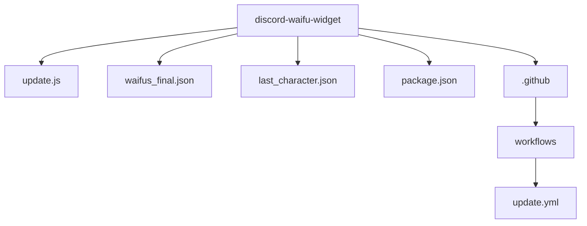
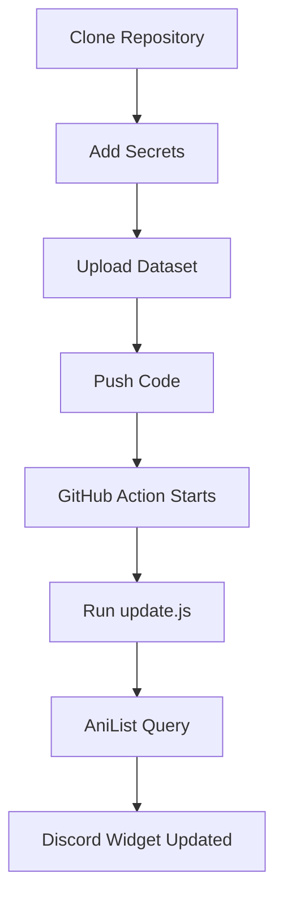

# 🌸 Discord Waifu Widget Framework

> **A fully automated Discord Dynamic Profile Widget that updates with a rotating Waifu of the Day using AniList metadata, GitHub Actions automation, and Discord’s Dynamic Widget API.**


---

# 🚀 Overview

This project automatically updates your Discord profile widget with a new **Waifu of the Day**.

The system rotates through a curated character dataset, fetches live metadata from AniList, enriches profile information, generates dynamic stats, and pushes everything directly to Discord’s Dynamic Widget API.

```text
No VPS
No Paid APIs
No Local Machine
No Manual Updates
100% Cloud Automated
```

---

# ✨ Widget Preview

Example output:

```text
WAIFU       → Makima
BIO         → Devil Hunter
DESCRIPTION → Tokyo Special Division 4
SOURCE      → Chainsaw Man

SIMPS       → 218K
VIBE        → ELEGANT
RANK        → LEGENDARY
AGE         → 19
BLOOD       → AB
WORLD       → GACHA
```

Alternative day:

```text
WAIFU       → Bronya
BIO         → Assassin
DESCRIPTION → Academy Student
SOURCE      → Honkai Star Rail

SIMPS       → 494K
VIBE        → ROYAL
RANK        → LEGENDARY
AGE         → 14+
BLOOD       → Unknown
WORLD       → GACHA
```

Includes:

```text
Character Artwork
Live AniList Metadata
Dynamic Stat Generation
```

---

# 🏗 System Architecture



---

# 🎲 Rotation Engine

The system uses persistent memory rather than random daily seed.

This guarantees:

```text
No duplicate consecutive characters

Sequential character rotation

Manual reroll support
```

Logic:



---

# 🧠 Metadata Engine

Unlike static widgets, this project enriches characters dynamically.

## BIO DETECTION

Auto detects roles:

```text
Hunter
Mage
Knight
Princess
Archon
Witch
Student
Assassin
Captain
Idol
Maid
Soldier
```

---

## DESCRIPTION ENGINE

Automatically parses AniList descriptions.

Cleans:

```text
HTML Tags

Height Fields

Birthday Fields

Blood Type Fields

Markdown Formatting

Broken Metadata Strings
```

Output example:

```text
Tokyo Special Division 4

Academy Student

Witch of Sin

Guild Member
```

---

# 🌐 Character Database

The dataset contains:

```text
302 manually curated female-only characters
```

Properties:

```text
Anime

Gacha Games

JRPG

Visual Novels

Gaming Characters
```

No duplicates.

No fake entries.

Balanced franchise coverage.

---

<details>

<summary>🌸 Supported Universes</summary>

## Anime

```text
Chainsaw Man
Re:Zero
Naruto
Bleach
One Piece
Jujutsu Kaisen
Attack on Titan
Date A Live
High School DxD
Cyberpunk Edgerunners
Violet Evergarden
Konosuba
Death Note
One Punch Man
```

---

## Gacha / Anime Games

```text
Genshin Impact
Honkai Star Rail
Zenless Zone Zero
Wuthering Waves
Nikke
Blue Archive
Azur Lane
```

---

## JRPG / Games

```text
Fate Series
Persona 5
NieR Automata
Final Fantasy VII
Resident Evil
Bayonetta
```

</details>

---

# 🌍 APIs Used

## AniList API

Used for:

```text
Character Search

Favorites Count

Age

Blood Type

Description

Character Artwork
```

Documentation:

:contentReference[oaicite:0]{index=0}

GraphQL Endpoint:

```text
https://graphql.anilist.co
```

---

## Discord Widget API

Method:

```text
PATCH
```

Endpoint:

```text
https://discord.com/api/v9/applications/{APP_ID}/users/{USER_ID}/identities/0/profile
```

---

# 🔄 API Execution Flow



---

# ⚙️ GitHub Actions Automation

Supports both scheduled and manual execution.

Schedule:

```text
Scheduled Auto Rotation

workflow_dispatch Manual Reroll
```

Flow:



---

# 📂 Project Structure



---

# 🔐 Required Secrets

Add these in:

```text
Settings → Secrets → Actions
```

Required:

```text
DISCORD_APP_ID

DISCORD_USER_ID

DISCORD_BOT_TOKEN
```

---

# 📦 Example Discord Payload

```json
{
  "data": {
    "dynamic": [
      {
        "name": "waifu",
        "value": "Makima"
      },
      {
        "name": "source",
        "value": "Chainsaw Man"
      },
      {
        "name": "fanbase",
        "value": "218K"
      },
      {
        "name": "vibe",
        "value": "ELEGANT"
      },
      {
        "name": "rating",
        "value": "LEGENDARY"
      },
      {
        "name": "age",
        "value": "19"
      },
      {
        "name": "blood",
        "value": "AB"
      },
      {
        "name": "bio",
        "value": "Devil Hunter"
      },
      {
        "name": "description",
        "value": "Tokyo Special Division 4"
      }
    ]
  }
}
```

---

# 🚀 Deployment



---

# ⚠️ Current Limitations

AniList metadata may fail for:

```text
Short names

Alias characters

Characters with ambiguous names
```

Reason:

```text
AniList exact search mismatch
```

---

# 🧰 Tech Stack

```text
Node.js

GitHub Actions

Axios

Discord API

AniList GraphQL API

JSON Database
```

---
