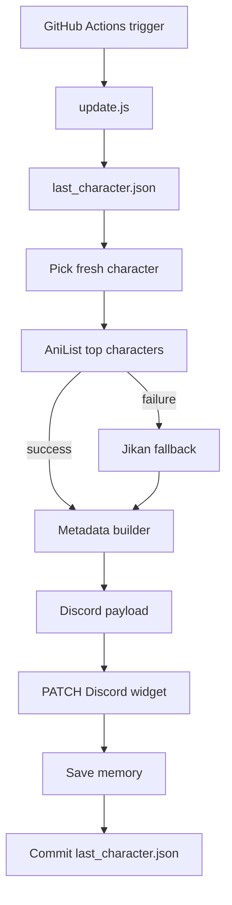

# 🌸 Discord Waifu Widget

> **Automated Discord Dynamic Profile Widget that rotates a live anime/game character using AniList metadata, Jikan fallback data, GitHub Actions, and Discord's Dynamic Widget API.**

<p align="center">
  
  
  
  
</p>

```text
No VPS              No paid APIs        No local machine
No frontend         No database         100% GitHub Actions automation
```

---

## What this project does

This repo updates a Discord profile widget with a rotating **Waifu of the Day**.

Each run:

1. Reads `last_character.json` to avoid recent repeats.
2. Pulls live characters from AniList top-character pages.
3. Filters AniList results to female characters.
4. Falls back to Jikan/MyAnimeList top-anime cast pages if AniList is unavailable.
5. Generates widget stats like fanbase, vibe, rating, age, blood type, bio, and universe.
6. Sends one full Discord Dynamic Identity payload.
7. Saves the new memory file only after a successful Discord update.

---

## Features

- 🌐 Live character discovery from AniList, no stale local character database
- 🚺 Female-character filtering when AniList is available
- 🎲 Manual reroll through GitHub Actions `workflow_dispatch`
- 🧠 AniList metadata enrichment
- 🛟 Jikan/MyAnimeList fallback when AniList is down/rate-limited
- 🖼 Nekos.best SFW artwork fallback so the workflow still updates during API outages
- 🖼 Character artwork field
- 🧾 Full Discord payload with `username` binding
- 🔐 GitHub Secrets for Discord credentials
- 🧪 Local `DRY_RUN=true` testing mode

---

## Documentation

| Document | Purpose |
| --- | --- |
| [Setup](docs/SETUP.md) | Discord app, widget fields, secrets |
| [Architecture](docs/ARCHITECTURE.md) | Runtime architecture and Mermaid diagrams |
| [API flow](docs/API_FLOW.md) | AniList, Jikan, Discord PATCH flow |
| [Widget fields](docs/WIDGET_FIELDS.md) | Exact Discord widget editor bindings |
| [Troubleshooting](docs/TROUBLESHOOTING.md) | Common issues and fixes |
| [Credits](docs/CREDITS.md) | References and acknowledgements |

---

## Widget fields

Bind these Discord widget fields as **User Data**:

| Field | Type | Description |
| --- | --- | --- |
| `waifu` | Text | Character name |
| `source` | Text | Anime/game/source title |
| `fanbase` | Text | Formatted popularity estimate |
| `vibe` | Text | Generated vibe label |
| `rating` | Text | Popularity tier |
| `age` | Text | AniList age, when available |
| `blood` | Text | AniList blood type, when available |
| `bio` | Text | Parsed role/category |
| `description` | Text | Clean short description |
| `universe` | Text | Source category |
| `image` | Image | Character artwork |

Full guide: [docs/WIDGET_FIELDS.md](docs/WIDGET_FIELDS.md)

---

## Quick start

### 1. Fork / clone

```bash
git clone https://github.com/MeYashverma/Discord-waifu-widget.git
cd Discord-waifu-widget
npm install
cp .env.example .env
```

### 2. Add credentials

Local `.env` or GitHub repository secrets:

```text
DISCORD_APP_ID=
DISCORD_USER_ID=
DISCORD_BOT_TOKEN=
```

Optional:

```text
WIDGET_USERNAME=waifu-widget
CHARACTER_SOURCE=auto   # auto, anilist, or jikan
MIN_SOURCE_PAGE=1
MAX_SOURCE_PAGE=5
DRY_RUN=false
```

### 3. Test locally

```bash
npm run check
DRY_RUN=true npm start
```

### 4. Run on GitHub Actions

Open:

```text
Actions → Update Discord Waifu Widget → Run workflow
```

Scheduled runs happen every 6 hours.

---

## High-level architecture



---

## Example payload

```json
{
  "username": "waifu-widget",
  "data": {
    "dynamic": [
      { "type": 1, "name": "waifu", "value": "Makima" },
      { "type": 1, "name": "source", "value": "Chainsaw Man" },
      { "type": 1, "name": "fanbase", "value": "420.0K" },
      { "type": 1, "name": "vibe", "value": "ELEGANT" },
      { "type": 1, "name": "rating", "value": "LEGENDARY" },
      { "type": 1, "name": "bio", "value": "Hunter" },
      {
        "type": 3,
        "name": "image",
        "value": { "url": "https://..." }
      }
    ]
  }
}
```

---

## Notes

- This is a personal/fan automation project.
- Character data is pulled live from AniList/Jikan instead of a local static character database.
- AniList may sometimes disable or rate-limit its API; Jikan fallback keeps the widget useful.
- Discord Dynamic Profile Widgets are experimental and may change.

---

## Credits

See [docs/CREDITS.md](docs/CREDITS.md).

---

## License

MIT — see [LICENSE](LICENSE).
