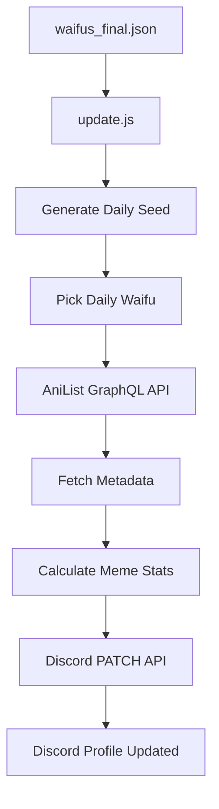
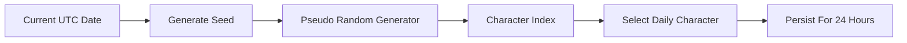
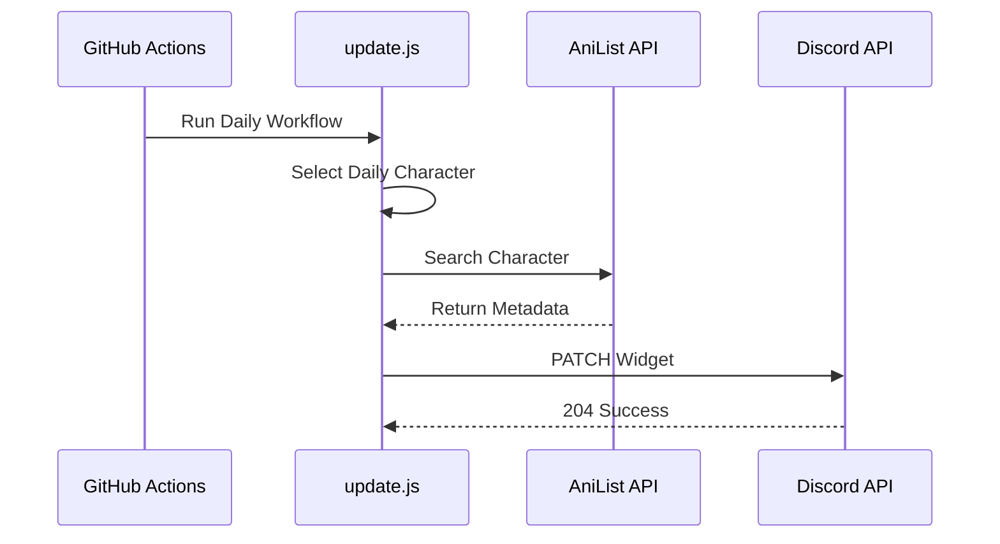
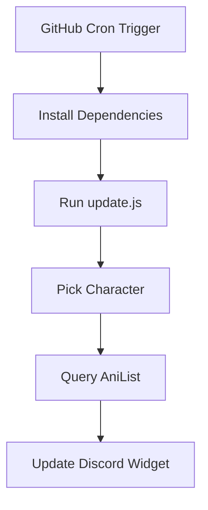
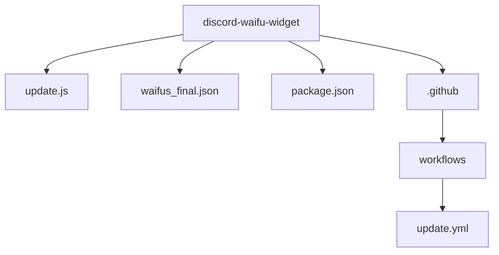
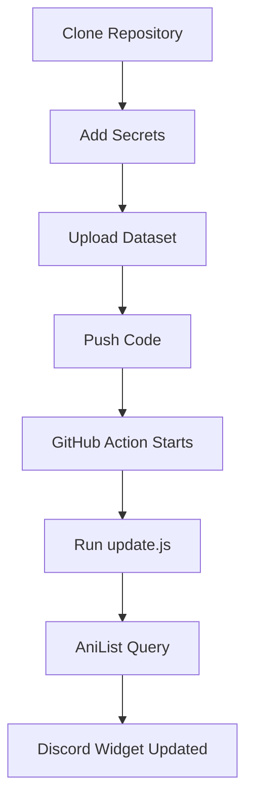

# 🌸 Discord Waifu Widget Framework

> **A fully automated Discord Dynamic Profile Widget that updates daily with a new Waifu of the Day using AniList, public APIs, and GitHub Actions.**


---

# 🚀 Overview

This project automatically updates your Discord profile every **24 hours** with a new **Waifu of the Day**.

The system selects a character from a curated dataset, fetches live metadata from AniList, calculates meme-style internet stats, and pushes everything directly to Discord’s experimental Dynamic Widget API.

```text
No VPS
No Paid APIs
No Local Machine
No Manual Updates
100% Cloud Automated
```

---

# ✨ Widget Preview

Example output:

```text
WAIFU      → Makima
SOURCE     → Chainsaw Man
FANBASE    → 218K
VIBE       → MOMMY
RATING     → TOUCH GRASS
```

Alternative day:

```text
WAIFU      → Raiden Shogun
SOURCE     → Genshin Impact
FANBASE    → 182K
VIBE       → EVERYONE SIMPS
RATING     → GOD TIER
```

Includes:

```text
Character Artwork
```

---

# 🏗 System Architecture



---

# 🎲 Daily Selection Engine

Each day generates a deterministic pseudo-random seed.

This guarantees:

```text
Same day = Same waifu

Next day = New waifu
```

Logic:



---

# 😂 Meme Logic Engine

Unlike boring widgets, this project uses cursed internet logic.

## VIBE

| Favorites | VIBE           |
| --------- | -------------- |
| <3K       | WHO?           |
| 3K–15K    | CUTE           |
| 15K–40K   | SMASH          |
| 40K–80K   | HEAR ME OUT    |
| 80K–150K  | MOMMY          |
| 150K+     | EVERYONE SIMPS |

---

## RATING

| Favorites | RATING      |
| --------- | ----------- |
| <5K       | MID         |
| 5K–20K    | GOOD        |
| 20K–50K   | DOWN BAD    |
| 50K–100K  | GOONED      |
| 100K–200K | GOD TIER    |
| 200K+     | TOUCH GRASS |

---

# 🌐 Character Database

The dataset contains:

```text
266+ manually curated real characters
```

No fake entries.

Balanced franchise representation.

No duplicate variants.

---

<details>

<summary>🌸 Supported Universes</summary>

## Anime

```text
Chainsaw Man
Re:Zero
Naruto
Bleach
One Piece
Jujutsu Kaisen
Spy x Family
Attack on Titan
Date A Live
High School DxD
Cyberpunk Edgerunners
Frieren
Konosuba
Evangelion
Steins Gate
Dress Up Darling
Bunny Girl Senpai
```

---

## Gacha / Anime Games

```text
Genshin Impact
Honkai Star Rail
Zenless Zone Zero
Wuthering Waves
Neverness To Everness
Nikke
Blue Archive
Azur Lane
```

---

## JRPG / VN

```text
Fate Series
Persona
NieR Automata
Final Fantasy
Stellar Blade
```

---

## Internet / Western Anime Adjacent

```text
Arcane
League of Legends
Overwatch
RWBY
Resident Evil
Street Fighter
Bayonetta
```

</details>

---

# 🌍 APIs Used

## AniList API

Used for:

```text
Character Search

Favorites Count

Character Artwork

Anime/Game Source Metadata
```

Documentation:

[AniList API Docs](https://anilist.gitbook.io/anilist-apiv2-docs/?utm_source=chatgpt.com)

GraphQL Endpoint:

```text
https://graphql.anilist.co
```

---

## Discord Widget API

Method:

```text
PATCH
```

Endpoint:

```text
https://discord.com/api/v9/applications/{APP_ID}/users/{USER_ID}/identities/0/profile
```

---

# 🔄 API Execution Flow



---

# ⚙️ GitHub Actions Automation

The workflow runs once every day.

Schedule:

```text
00:05 UTC Daily
```

Flow:



---

# 📂 Project Structure



---

# 🔐 Required Secrets

Add these in:

```text
Settings → Secrets → Actions
```

Required:

```text
DISCORD_APP_ID

DISCORD_USER_ID

DISCORD_BOT_TOKEN
```

---

# 📦 Example Discord Payload

```json
{
  "data": {
    "dynamic": [
      {
        "type": 1,
        "name": "waifu",
        "value": "Makima"
      },
      {
        "type": 1,
        "name": "source",
        "value": "Chainsaw Man"
      },
      {
        "type": 1,
        "name": "fanbase",
        "value": "218K"
      },
      {
        "type": 1,
        "name": "vibe",
        "value": "MOMMY"
      },
      {
        "type": 1,
        "name": "rating",
        "value": "TOUCH GRASS"
      }
    ]
  }
}
```

---

# 🚀 Deployment



---

# ⚠️ Current Limitations

AniList exact search may fail for:

```text
2B

Saber

C.C.

D.Va
```

Reason:

```text
Exact search mismatch
```

---

# 🔮 Planned Upgrades

* [x] Daily Character Rotation
* [x] AniList API Integration
* [x] Discord Dynamic Widget API
* [x] Meme Rating Engine
* [x] Character Artwork Support
* [x] GitHub Actions Automation
* [ ] Smart Search Resolver
* [ ] Seasonal Event Modes
* [ ] Alternate Widget Themes
* [ ] Trending Anime Mode
* [ ] NSFW Private Build
* [ ] Community Voting System

---

# 🧰 Tech Stack

```text
Node.js

GitHub Actions

Axios

Discord API

AniList GraphQL API

JSON Database
```

---
