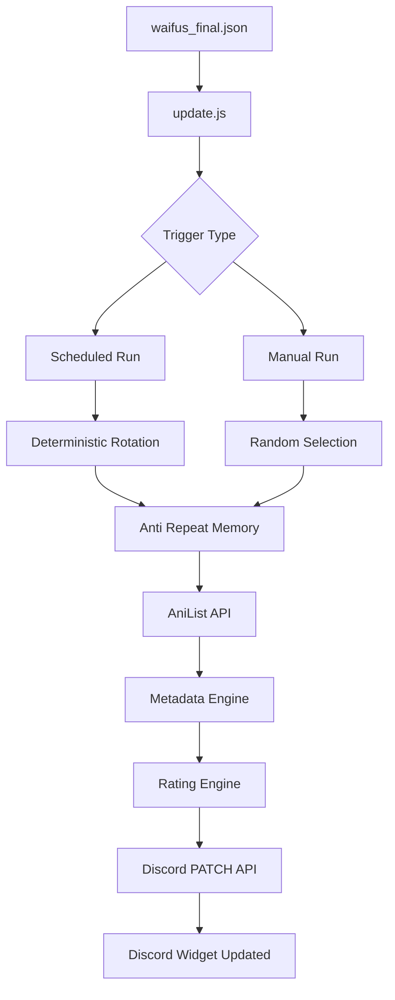
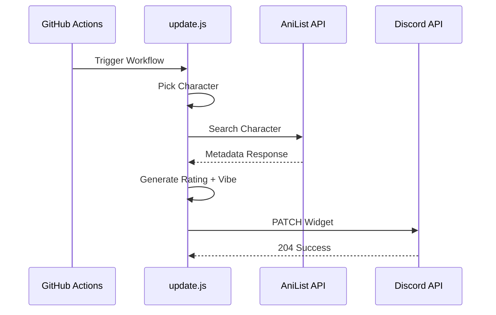
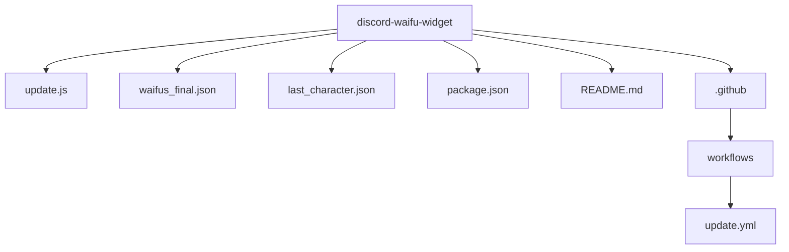

# 🌸 Discord Waifu Widget Framework v2.0

> A fully automated Discord Dynamic Profile Widget that continuously rotates curated anime/game waifus using GitHub Actions, AniList API, intelligent metadata engines, and Discord Dynamic Widget API.


---

# 🚀 Overview

This project automatically updates your Discord profile widget with a rotating **Waifu Showcase System**.

Every scheduled run rotates through a curated character database while manual runs trigger random rerolls.

```text
No VPS

No Paid APIs

No Local Machine

100% GitHub Automated
```

---

# ✨ Widget Preview

Example output:

```text
WAIFU      → Makima
SOURCE     → Chainsaw Man
FANBASE    → 420K
VIBE       → MANIPULATIVE
RATING     → GOD TIER
UNIVERSE   → ANIME
```

Alternative:

```text
WAIFU      → Raiden Shogun
SOURCE     → Genshin Impact
FANBASE    → 455K
VIBE       → DOMINANT
RATING     → GOD TIER
UNIVERSE   → GACHA
```

Includes:

```text
Dynamic Character Artwork
```

---

# 🏗 System Architecture



---

# 🎲 Selection Engine

## Scheduled GitHub Action

Runs sequentially.

```text
Character 1

Character 2

Character 3
...
```

Never repeats immediately.

---

## Manual Workflow Run

GitHub manual trigger:

```text
workflow_dispatch
```

Behavior:

```text
Random character selection

Avoid immediate duplicate
```

---

# 🧠 Metadata Engine

The widget combines:

```text
AniList real metadata

Manual character overrides

Fallback franchise-weighted generation
```

Priority:

```text
AniList API → if available

Manual override → if configured

Generated metadata → fallback
```

---

# ⭐ Rating Engine

Characters are scored dynamically.

Possible ratings:

```text
GOD TIER

ELITE WAIFU

LEGENDARY

ICONIC

POPULAR

RISING STAR
```

Example:

| Popularity | Rating |
| ---------- | ------ |
| 400K+      | GOD TIER |
| 250K+      | ELITE WAIFU |
| 150K+      | LEGENDARY |
| 80K+       | ICONIC |
| 30K+       | POPULAR |
| lower      | RISING STAR |

---

# 🎭 Vibe Engine

Randomized or manually overridden personality metadata.

Possible values:

```text
DOMINANT

SEDUCTIVE

MYSTERIOUS

PLAYFUL

CONFIDENT

CHAOTIC

WHOLESOME

TSUNDERE

YANDERE

DEADLY
```

Examples:

| Character | Vibe |
| ---------- | ---- |
| Makima | MANIPULATIVE |
| Esdeath | DOMINANT |
| Rem | WHOLESOME |
| Kurumi Tokisaki | CHAOTIC |
| Bayonetta | CONFIDENT |

---

# 🌐 Character Database

Current dataset:

```text
300+ manually curated characters
```

Rules:

```text
Female only

No fake entries

No duplicate variants

Manual franchise verification
```

---

<details>

<summary>🌸 Supported Universes</summary>

## Anime

```text
Chainsaw Man
Re Zero
High School DxD
Date A Live
Fairy Tail
Demon Slayer
Jujutsu Kaisen
Attack on Titan
Spy x Family
One Piece
Naruto
Bleach
Code Geass
Konosuba
Overlord
Evangelion
Akame ga Kill
Kill la Kill
Dragon Ball
Death Note
One Punch Man
Cyberpunk Edgerunners
```

---

## Gacha

```text
Genshin Impact
Honkai Star Rail
Zenless Zone Zero
Wuthering Waves
Nikke
Blue Archive
Azur Lane
Arknights
Punishing Gray Raven
```

---

## JRPG

```text
Fate Series
Persona
NieR Automata
Final Fantasy
Tales Series
```

---

## Games

```text
Resident Evil
League of Legends
Tekken
Street Fighter
Bayonetta
Metroid
Tomb Raider
Darkstalkers
Cyberpunk 2077
```

</details>

---

# 🔄 API Execution Flow



---

# ⚙️ GitHub Actions Automation

Schedule:

```text
Every 6 Hours
```

Cron:

```yaml
0 */6 * * *
```

Supports:

```text
Automatic rotation

Manual reroll

Persistent memory
```

---

# 📂 Project Structure



---

# 🔐 Required Secrets

GitHub:

```text
Settings → Secrets → Actions
```

Required:

```text
DISCORD_APP_ID

DISCORD_USER_ID

DISCORD_BOT_TOKEN
```

---

# 📦 Example Discord Payload

```json
{
  "data": {
    "dynamic": [
      {
        "type": 1,
        "name": "waifu",
        "value": "Makima"
      },
      {
        "type": 1,
        "name": "source",
        "value": "Chainsaw Man"
      },
      {
        "type": 1,
        "name": "fanbase",
        "value": "420K"
      },
      {
        "type": 1,
        "name": "vibe",
        "value": "MANIPULATIVE"
      },
      {
        "type": 1,
        "name": "rating",
        "value": "GOD TIER"
      },
      {
        "type": 1,
        "name": "universe",
        "value": "ANIME"
      }
    ]
  }
}
```

---

# 🧰 Tech Stack

```text
Node.js

GitHub Actions

Axios

AniList GraphQL API

Discord Dynamic Widget API

JSON Dataset
```

