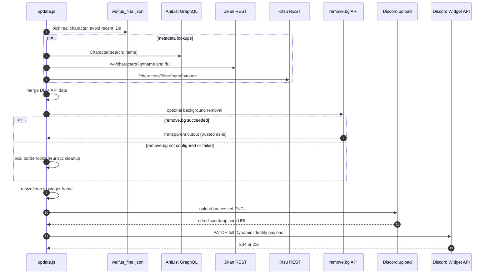

# API Flow

The widget uses a hybrid approach: a local verified character database provides stable names/sources, while public APIs enrich the selected character with artwork and metadata.



## Source priority

| Data | Priority |
| --- | --- |
| Character name/source/universe | `waifus_final.json` |
| Bio/description | verified seed details → AniList/Jikan/Kitsu text → generated fallback |
| Image | database image → AniList → Jikan → Kitsu → Nekos.best fallback |
| Background removal | remove.bg when `REMOVE_BG_API_KEY` exists and the call succeeds (its cutout is trusted as-is); local border/color heuristic only runs as a fallback when remove.bg is not configured or fails |

## Discord PATCH

```http
PATCH https://discord.com/api/v9/applications/{DISCORD_APP_ID}/users/{DISCORD_USER_ID}/identities/0/profile
Authorization: Bot {DISCORD_BOT_TOKEN}
Content-Type: application/json
```

The payload includes the root `username` plus all dynamic fields in a single PATCH.
