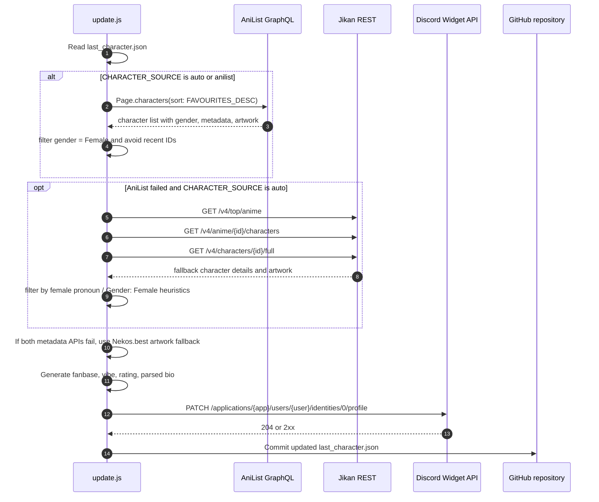

# API Flow

This document covers the external API flow for the dynamic, no-custom-database version of the widget.

---

## APIs used

| API | Type | Purpose |
| --- | --- | --- |
| AniList GraphQL | HTTPS POST | Primary live source for popular female characters |
| Jikan REST | HTTPS GET | Fallback via MyAnimeList top anime cast and character pages |
| Nekos.best | HTTPS GET | Emergency SFW artwork fallback during AniList/Jikan outages |
| Discord Profile Widget API | HTTPS PATCH | Update Dynamic Profile Widget fields |
| GitHub repository | git push | Persist recent-pick memory in `last_character.json` |

---

## Full flow



---

## AniList GraphQL

Endpoint:

```text
https://graphql.anilist.co
```

Query:

```graphql
query ($page: Int, $perPage: Int) {
  Page(page: $page, perPage: $perPage) {
    characters(sort: FAVOURITES_DESC) {
      id
      siteUrl
      name { full native }
      gender
      favourites
      age
      bloodType
      description(asHtml: false)
      image { large }
      media(sort: POPULARITY_DESC, perPage: 1) {
        nodes { title { romaji english native } }
      }
    }
  }
}
```

Used fields:

| AniList field | Widget use |
| --- | --- |
| `gender` | Female-character filtering |
| `name.full` | `waifu` field |
| `favourites` | Popularity/fanbase baseline |
| `age` | `age` field |
| `bloodType` | `blood` field |
| `description` | `bio` and `description` parsing |
| `image.large` | `image` field |
| `media.nodes[0].title` | `source` field |

---

## Jikan fallback

Base URL:

```text
https://api.jikan.moe/v4
```

Fallback calls:

```text
GET /top/anime?page={page}&limit=10
GET /anime/{animeId}/characters
GET /characters/{characterId}/full
```

Jikan does not provide a clean gender field on every list response, so the fallback uses the full character `about` text and accepts candidates that clearly look female, for example `Gender: Female`, `she`, `her`, `girl`, `woman`, `princess`, or `goddess`.

AniList is still the preferred source because it exposes `gender` directly.

---

## Discord Profile Widget PATCH

Endpoint:

```http
PATCH https://discord.com/api/v9/applications/{DISCORD_APP_ID}/users/{DISCORD_USER_ID}/identities/0/profile
Authorization: Bot {DISCORD_BOT_TOKEN}
Content-Type: application/json
User-Agent: DiscordBot (https://github.com/discord/discord-api-docs, 1.0.0)
```

Payload shape:

```json
{
  "username": "waifu-widget",
  "data": {
    "dynamic": [
      { "type": 1, "name": "waifu", "value": "Makima" },
      { "type": 1, "name": "source", "value": "Chainsaw Man" },
      { "type": 1, "name": "fanbase", "value": "420.0K" },
      { "type": 1, "name": "vibe", "value": "ELEGANT" },
      { "type": 1, "name": "rating", "value": "LEGENDARY" },
      { "type": 1, "name": "age", "value": "Unknown" },
      { "type": 1, "name": "blood", "value": "Unknown" },
      { "type": 1, "name": "bio", "value": "Hunter" },
      { "type": 1, "name": "description", "value": "Special Division" },
      { "type": 1, "name": "universe", "value": "ANIME" },
      { "type": 3, "name": "image", "value": { "url": "https://..." } }
    ]
  }
}
```

---

## Rate-limit notes

- Default workflow frequency is every 6 hours.
- AniList is called once per attempt.
- Jikan fallback may call several endpoints, so the script waits between character-detail requests.
- Discord receives one PATCH per successful run.
