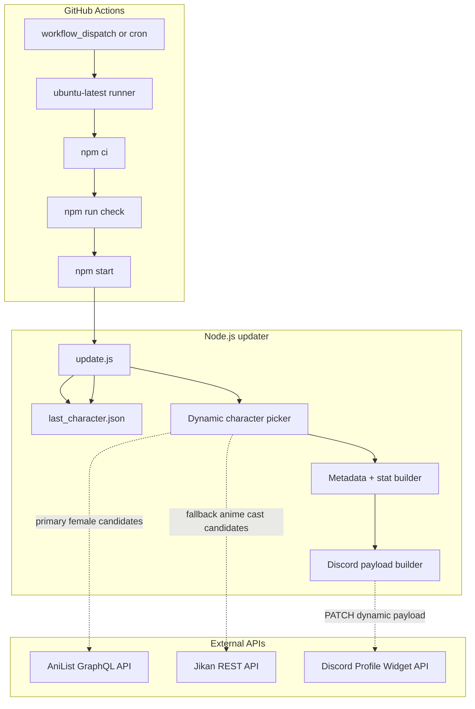
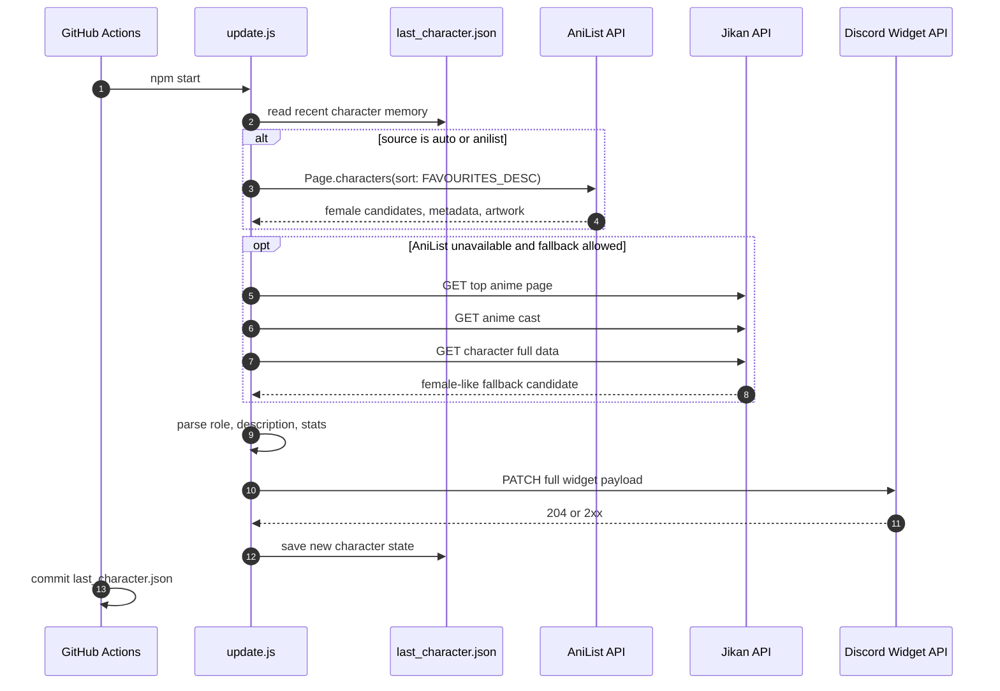
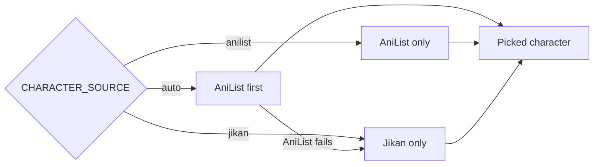

# Architecture

This document explains the runtime design of the Discord Waifu Widget after removing the stale custom character database.

---

## Runtime overview



---

## Update lifecycle



---

## Source modes



| Mode | Behavior |
| --- | --- |
| `auto` | Try AniList female top characters, then Jikan fallback |
| `anilist` | Use only AniList and fail if AniList is unavailable |
| `jikan` | Use Jikan top-anime cast fallback only |

---

## Memory model

`last_character.json` only stores recent picks. It is not a character database.

```json
{
  "lastId": "anilist:12345",
  "lastName": "Makima",
  "recent": ["anilist:12345", "jikan:9876"],
  "provider": "anilist",
  "updatedAt": "2026-07-05T12:00:00.000Z"
}
```

The workflow commits this file after a successful Discord update so the next run can avoid repeats.

---

## Failure strategy

| Failure | Behavior |
| --- | --- |
| Missing Discord env vars | Fail fast before API work |
| Invalid memory file | Reset memory safely |
| AniList unavailable | Try Jikan when `CHARACTER_SOURCE=auto` |
| Jikan rate-limited | Wait briefly and try another page until attempts are exhausted |
| No candidate found | Fail without changing memory |
| Discord PATCH fails | Exit non-zero and do not save memory |
| Successful PATCH | Save memory and let workflow commit it |

---

## Why this is better than a custom database

The old version depended on `waifus_final.json`, which eventually becomes stale. The new version uses live public APIs:

- AniList for popular female characters and rich metadata.
- Jikan/MyAnimeList as a backup source when AniList is down.
- `last_character.json` only for repeat avoidance, not as source data.
