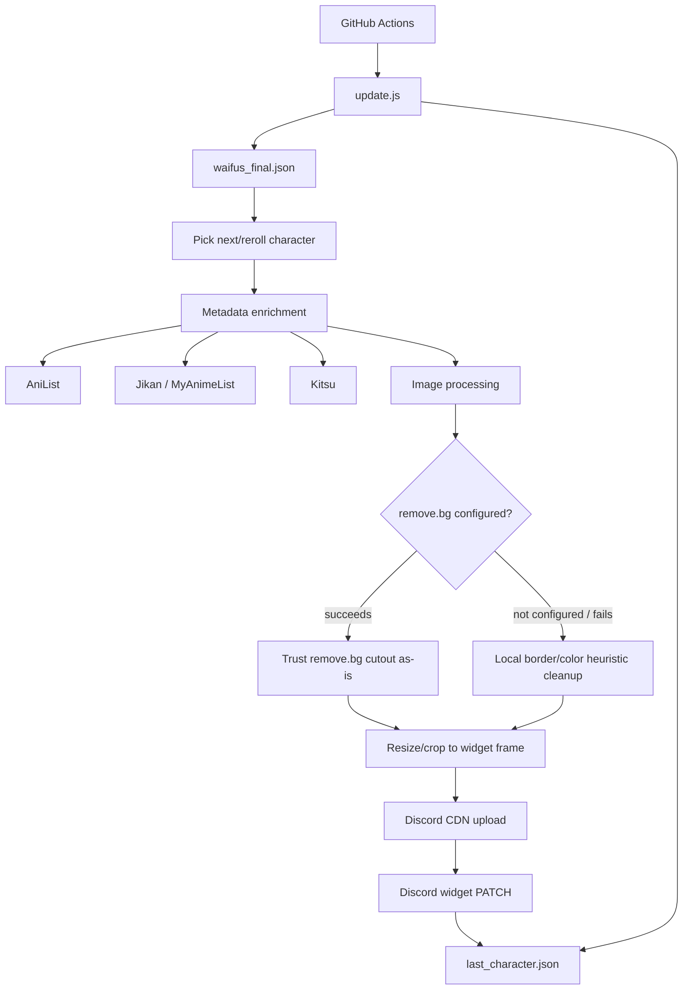

# Architecture

This version uses a hybrid design: a local verified database keeps character identity stable, and live APIs improve images/details whenever they are available.

## Why this approach

The previous purely-live approach could show generic fallback text when AniList/Jikan were down. The old purely-static approach became stale. The hybrid approach gives both:

- stable real character fields from `waifus_final.json`;
- better images and metadata from AniList/Jikan/Kitsu;
- optional remove.bg background removal, trusted as-is when it succeeds (a local
  border/color heuristic only kicks in as a fallback when remove.bg is not
  configured or fails — it is not layered on top of a successful remove.bg
  result, since that could clip legitimate character pixels instead of
  improving remove.bg's own cutout; see
  [TROUBLESHOOTING.md](TROUBLESHOOTING.md#faint-background-fringe-after-removebg));
- Discord-CDN hosted PNGs for reliable widget rendering;
- memory-based repeat avoidance.

## Memory

`last_character.json` stores rotation state and the last enriched payload cache. It is committed back by GitHub Actions after a successful Discord update.
